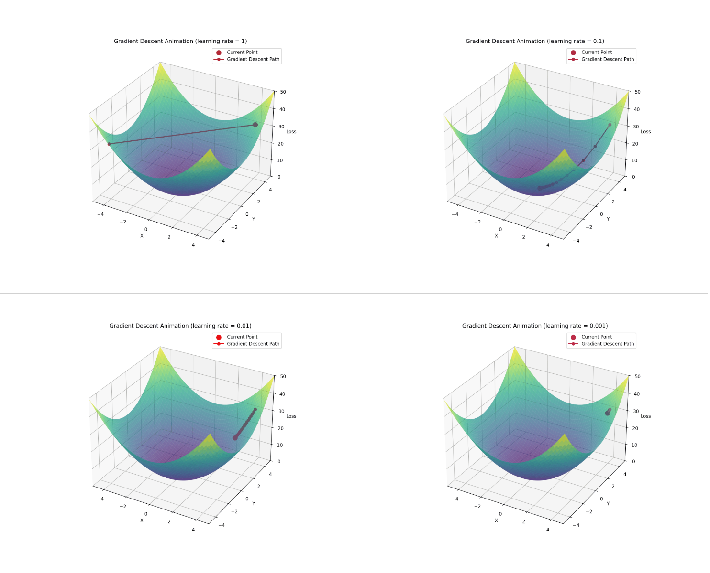

# DL Notes

This repository contains implementations and visualizations of fundamental machine learning(Deep learning) concepts.

## Projects

### Gradient Descent

Visualization of gradient descent optimization with different learning rates (1.0, 0.1, 0.01, 0.001). The animations demonstrate how learning rate affects convergence speed and stability.

[View Gradient Descent Project](gd/README.md)

### XOR Problem Visualization

Visualization of the XOR problem, demonstrating why it's not linearly separable and requires a neural network with at least one hidden layer to solve.

## License

This project is open source and available under the MIT License.
