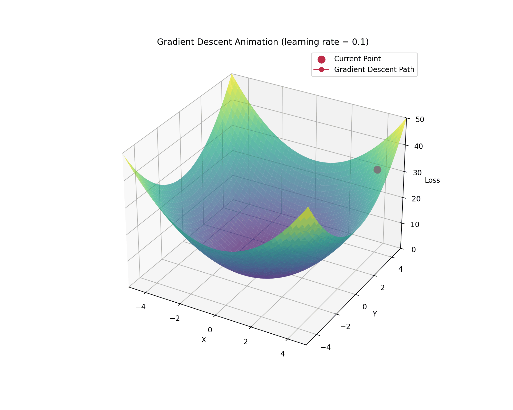

# Gradient Descent
GD Animation & learning rate (1, 0.1,0.01, 0.001)

## Learning Rate Comparison

The following animations show the effect of different learning rates on gradient descent optimization:

<table>
  <tr>
    <td></td>
    <td></td>
  </tr>
  <tr>
    <td></td>
    <td></td>
  </tr>
</table>

*Top left: Learning Rate = 1.0*  
*Top right: Learning Rate = 0.1*  
*Bottom left: Learning Rate = 0.01*  
*Bottom right: Learning Rate = 0.001*

As shown in the animations, the learning rate significantly affects the convergence speed and stability of the gradient descent algorithm. A high learning rate (1.0) may cause the algorithm to overshoot or diverge, while a very low learning rate (0.001) results in slow convergence. A moderate learning rate (0.1) often provides a good balance between convergence speed and stability.
